# 🎬 Kino

Kino — це повноцінна система керування каталогом фільмів на **Laravel 13** із адміністративною панеллю, системою ролей, кешуванням, інтеграцією із зовнішніми API та сучасним фронтендом на Vue 3.
> **У цифрах**
> - 600+ PHPUnit тестів
> - 25+ моделей
> - 50+ контролерів
> - 40+ міграцій
> - 4 зовнішні API
> - Docker-ready
---

## Функціонал

- Каталог фільмів
- Live-пошук (Vue 3)
- Коментарі (Vue 3)
- Лайки та перегляди (Vue 3)
- Адміністративна панель Admin-LTE 4
- YouTube-трейлери (через файл чи посилання)
- Галерея зображень (Fancybox)
- Карусель фільмів OWL Carousel
- SEO-оптимізація (title, description)
- Імпорт фільмів через OMDb API
- Telegram-повідомлення через бот з кнопками публікації
- Автоматична конвертація зображень у WebP (Spatie Image)
- Автоматичне створення кількох розмірів зображень: poster • thumb • search • gallery
- Seeders та Factories для швидкого наповнення бази
- Покриття основних сервісів PHPUnit-тестами
- Email-підписка (керування підписниками)
- Блок «Рекомендовані фільми» (checkbox)
- Статуси фільмів Draft / Published
- Підтримка Soft Deletes для фільмів
- Очікувані прем'єри (TMDb API)
- Блок «Дивитись ще» (Random)
- Livewire-компоненти
    - Автоматичне завантаження рейтингу IMDb
- Використання черг Laravel для коментарів та пошти
- Підтримка кешування через Redis (з Cache Tags)
- Автоматичне очищення кешу після створення, оновлення та видалення фільмів
- Візуальний редактор TinyMCE для редагування описів фільмів


## Безпека

- Аутентифікація через Laravel (сесії)
- OAuth авторизація через Google
- Контроль доступу на основі ролей:
    - Адміністратор
    - Редактор
    - Переглядач
    - Користувач
- Авторизація через Laravel Policies
- Захист дій через `$this->authorize()`
- Контроль доступу у Blade через `@can` / `@cannot`
- Захист адміністративних маршрутів через Middleware
- Middleware для блокування забанених акаунтів
- CSRF Protection
- Laravel Sanctum (підготовлено для API-аутентифікації)


---

## Архітектура

Проєкт побудований з використанням:

- Service Layer
- Repository Pattern
- Form Requests
- DTO-подібного підходу
- Media Abstraction Layer
- Observer Pattern
- Traits
- Policies
- Custom Casts
- Custom Validation Rules
- Dependency Injection
- Caching Layer (Redis + Cache Tags)
- Custom Middleware

---

## Використані технології

**Backend**

- PHP 8.4
- Laravel 13
- MySQL
- Laravel Eloquent ORM
- Redis

**Frontend**

- Vue 3
- Bootstrap 5
- Livewire
- TinyMCE (редактор контенту)
- OWL Carousel
- Fancybox

**Libraries**

- Spatie Image

**External APIs**

- OMDb API
- TMDb API
- Telegram Bot API
- Google OAuth 2.0

**Testing**

- PHPUnit (Feature + Unit tests)

**Infrastructure**

- Docker / Docker Compose


> **Примітка щодо Google OAuth:** Google вимагає HTTPS для redirect URI,
> окрім домену `localhost`. Для локального тестування використовуйте
> `http://localhost` замість кастомного dev-домену, або налаштуйте HTTPS
> (наприклад, через `mkcert`).
---

## Встановлення

```bash
git clone <repository>

cd kino

cp .env.example .env

# Встановлюємо PHP та Node.js залежності
composer install
npm install

# Піднімаємо Docker-контейнери (MySQL, Redis тощо)
docker compose up -d

# Генеруємо ключ додатку
docker compose exec app php artisan key:generate

# Створюємо символічне посилання для сховища
docker compose exec app php artisan storage:link

# Виконуємо міграції та наповнюємо базу даних (контейнери вже мають працювати)
docker compose exec app php artisan migrate --seed

# Збираємо фронтенд
npm run build

# Якщо не використовується Docker
php artisan serve
```

Після запуску застосунок буде доступний за адресою, вказаною в `APP_URL`.

---

## Додаткові команди

Генерація стандартних WebP-зображень

```bash
php artisan media:generate-default-images
```

---

## Обліковий запис адміністратора

Після виконання

```bash
php artisan migrate --seed
```

створюється адміністратор.

Email (значення береться із файлу `.env`):

```
ADMIN_EMAIL=
```

Пароль (значення береться із файлу `.env`):

```
ADMIN_PASSWORD=
```

---


## Налаштування `.env`

Необхідно заповнити:

- `DB_*`
- `TMDB_API_KEY=`
- `OMDB_API_KEY=`
- `GOOGLE_CLIENT_ID=`
- `GOOGLE_CLIENT_SECRET=`
- `TELEGRAM_BOT_TOKEN=`
- `TELEGRAM_CHAT_ID=`
- `TELEGRAM_WEBHOOK_SECRET=`


## Налаштування пошти

Для локального тестування пошти можна використати Mailtrap Sandbox.

Заповніть у `.env`:

```env
MAIL_MAILER=smtp
MAIL_HOST=...
MAIL_PORT=2525
MAIL_USERNAME=...
MAIL_PASSWORD=...
MAIL_FROM_ADDRESS=...
```

`MAIL_TEST_RECIPIENT=` використовується лише для тестового маршруту `/send`.


## Redis (опціонально)

Проєкт підтримує Redis для кешування та Cache Tags.

Для використання Cache Tags та кешування змініть у `.env`:

```env
CACHE_STORE=redis
```

За замовчуванням використовується array-драйвер, який не потребує Redis.

```env
CACHE_STORE=array
```


## Тестування

```bash
php artisan test
```

або

```bash
php artisan test --parallel
```

---


## Скріншоти

### Фронтенд

#### Головна сторінка
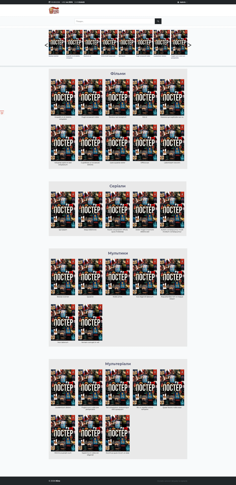

#### Сторінка фільму
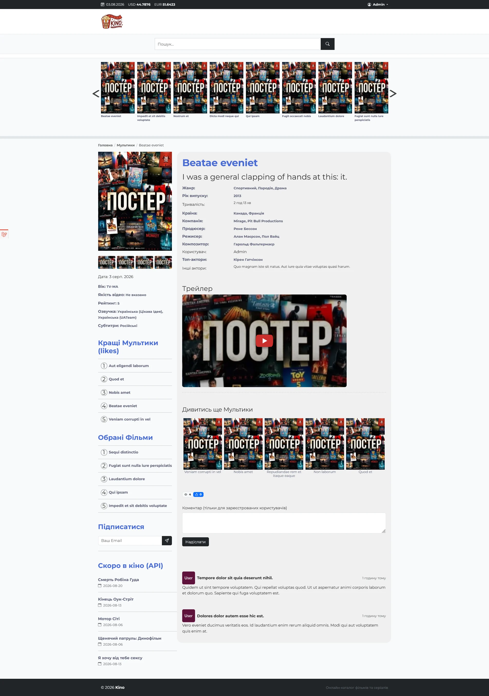

#### Сторінка фільму (мобільна версія)
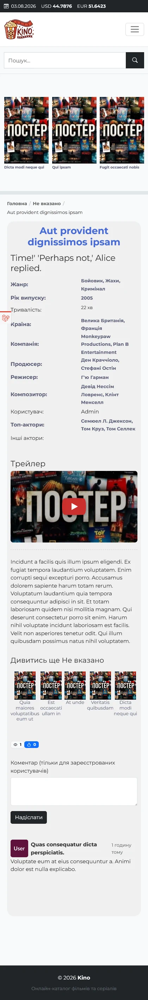

#### Live-пошук
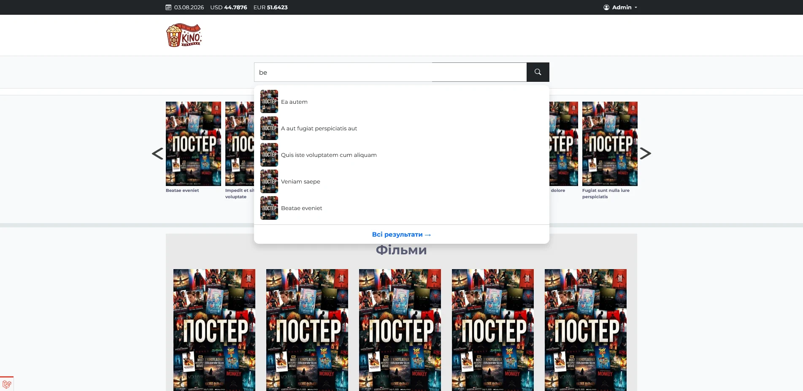

#### Сторінка актора
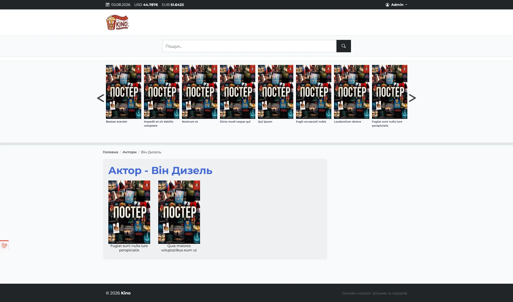


### Бекенд

#### Сторінка списку фільмів
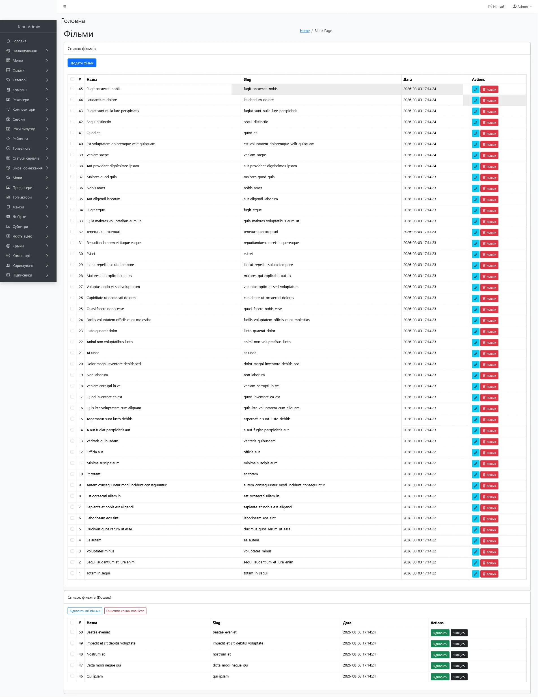

#### Сторінка створення фільму
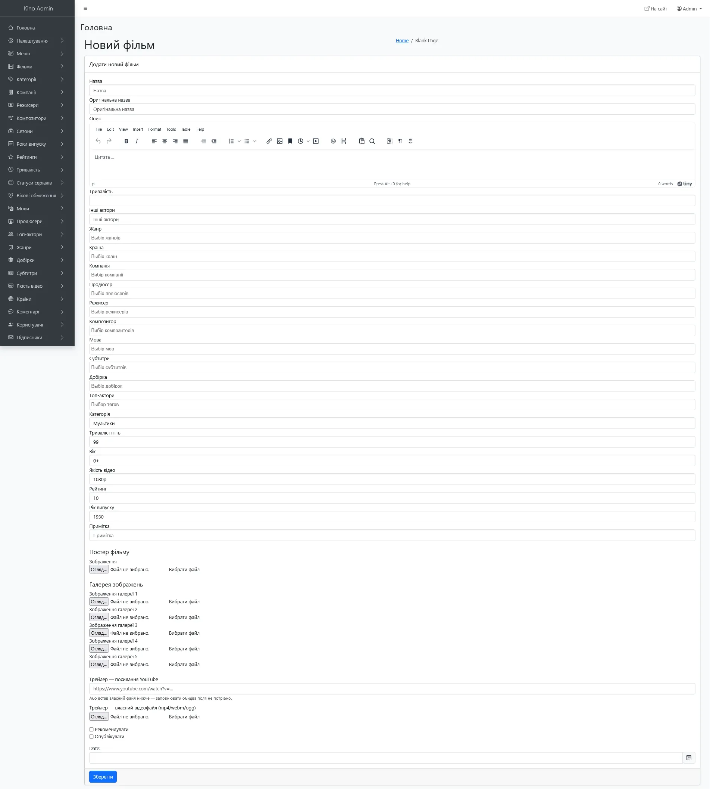

#### Сторінка імпорту фільму
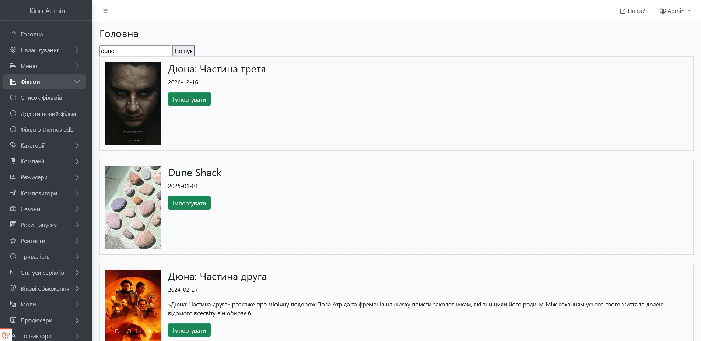

#### Сторінка користувачів
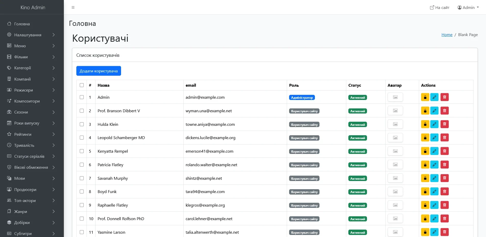

#### Сторінка коментарів
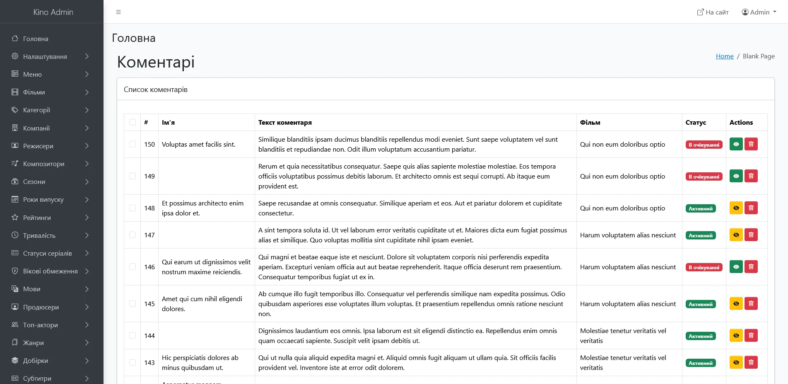

#### Сторінка профілю користувача
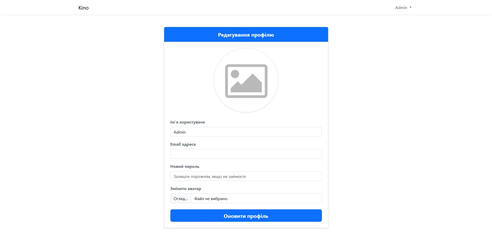


